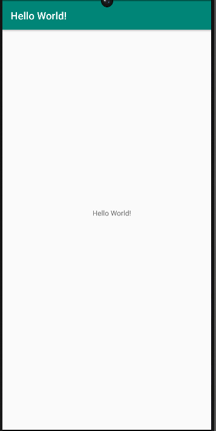

# Rapport

**Skriv din rapport här!**

Jag började med att göra en ny konto i Github till en skolkonto.
Därefter laddades det ner Android Studio på min dator. Efter jag
gjorde det använde jag Fork på "mobileapp-programming-hello" för
hämta repository till min konto. Efter det ändrades det på string.xml
filen från "Hello" till "Hello World!". Som sist gjorde jag commit på
Github.

```
<resources>
    <string name="app_name">Hello World!</string>
</resources>
```

